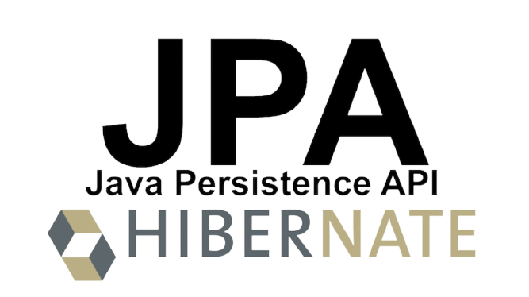
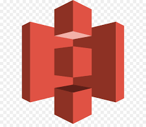

# 자율 프로젝트

## 목차

- 자율 프로젝트
  - [목차](#목차)
  - [카테고리](#카테고리)
  - [프로젝트 소개](#프로젝트-소개)
  - [팀 소개](#팀-소개)
  - [기술 스택](#기술-스택)
  - [프로젝트 진행](#프로젝트-진행)
    - [자율-1주차](#자율-1주차)
    - [자율-2주차](#자율-2주차)
    - [자율-3주차](#자율-3주차)

<!-- 필수 항목 -->

## 카테고리

| Application                       | Domain                                | Language                      | Framework                            |
| --------------------------------- | ------------------------------------- | ----------------------------- | ------------------------------------ |
| :white_check_mark: Desktop Web    | :black_square_button: AI              | :white_check_mark: JavaScript | :black_square_button: Vue.js         |
| :white_check_mark:  Mobile Web    | :white_check_mark: Big Data           | :white_check_mark: TypeScript | :white_check_mark: React             |
| :white_check_mark: Responsive Web | :black_square_button: Blockchain      | :black_square_button: C/C++   | :black_square_button: Angular        |
| :black_square_button: Android App | :black_square_button: IoT             | :black_square_button: C#      | :black_square_button: Node.js        |
| :black_square_button: iOS App     | :black_square_button: AR/VR/Metaverse | :black_square_button: Python  | :black_square_button: Flask/Django   |
| :black_square_button: Desktop App | :black_square_button: Game            | :white_check_mark: Java       | :white_check_mark: Spring/Springboot |
|                                   |                                       | :black_square_button: Kotlin  | :white_check_mark: Next.js           |

[프론트엔드 학습내용](/문서/FRONTEND.md)  
[백엔드 학습내용](/문서/BACKEND.md)

<!-- 필수 항목 -->

## 프로젝트 소개

- 프로젝트명 :  Make our special:어드벤트 스페셜데이

  > 안녕하세요 어스입니다
  >
  > 특별한 날을 기다리며 매일 매일 설레는 마음으로 언박싱하는 기분 느껴보고 싶지 않으신가요?
  >
  > 소중한 날을 기념하여 자신 또는 가족, 친구, 지인, 연인분께 직접 꾸민 어드벤트 스페셜데이를 선물해보세요

  - 노션 : [어스](https://www.notion.so/233191af396f4354a629fe7b39bae698)

- 서비스 특징

  - 서비스

- 기간 : 2022.04.11 ~ 2022.05.27

- 주요 기능

  | 기능   | 내용 |
  | ------ | ---- |
  | 서비스 |      |
  |        |      |
  |        |      |
  
  - 상세기능
    
    - 소셜로그인
      - 카카오 소셜로그인 제공
    - 메인페이지
      - 로그인 유저
        - 
      - 비로그인 유저
        - 
    - 프로필
      - 
    - 
  
- 주요 기술

  - Single Page Application
  - CSS
  - REST API

- 배포 환경

  - URL : // 웹 서비스, 랜딩 페이지, 프로젝트 소개 등의 배포 URL 기입

<!-- 자유 양식 -->

## 팀 소개

- 손민기 : `팀장`, 프론트엔드 개발
- 문찬송 : 프론트엔드 개발
- 하지애 : 프론트엔드 개발
- 김경민 : 백엔드 개발
- 박소진 : 백엔드 개발
- 오윤진 : 백엔드 개발

<!-- 자유 양식 -->

## 기술 스택

### **Front-end**

|  |  |  |  |  |  |  |
| :----------------------------------------------------------: | :----------------------------------------------------------: | :----------------------------------------------------------: | :----------------------------------------------------------: | :-------------------------------------------------------: | :----------------------------------------------------------: | :----------------------------------------------------------: |
|                            HTML5                             |                             CSS3                             |                       JavaScript(ES6)                        |                           React.js                           |                          NEXT.js                          |                          TypeScript                          |                      Semantic UI React                       |

### **Back-end**

|  |  |  |  |  |
| :----------------------------------------------------------: | :---------------------------------------------------: | :------------------------------------------------------: | :-------------------------------------------------------: | :--------------------------------------------------------: |
|                          Springboot                          |                          JPA                          |                          Gradle                          |                          Swagger                          |                          QueryDSL                          |

### **CI/CD**

|  |
| :-------------------------------------------------------: |
|                          Jenkins                          |

### **Server**

|  |  |  |  |
| :------------------------------------------------------: | :---------------------------------------------------: | :-----------------------------------------------------: | :----------------------------------------------------------: |
|                          Docker                          |                          aws                          |                         aws s3                          |                            NGINX                             |

### **DB**

|  |
| :-----------------------------------------------------: |
|                          MySQL                          |

### **Version Control**

|  |  |
|:-----------------------------------------------------------------------------------------------------------------:|:--------------------------------------------------------------------------------------------------------------:|
| Git                                                                                                               | GitLab                                                                                                         |

### **Issue Tracking System**

|  |
|:----------------------------------------------------------------------------------------------------------------------------------------------------------------------------------------:|
| Jira                                                                                                                                                                                     |

## 프로젝트 진행

### 자율-1주차

- 기간 : 2022.04.11 ~ 2022.04.15 (1주)

- 목표 :  프로젝트기획 및 설계

- 진행상황
  
  - [서비스를-개발하기-전-기획-고민](/문서/서비스를-개발하기-전-기획-고민/README.md)
  
  - [MVP](/문서/MVP/README.md)
  
  - [와이어프레임-작성](/문서/와이어프레임-작성/README.md)
  
  - [화면설계](/문서/화면설계/README.md)
  
  - [기술스택](/문서/기술스택/README.md)
  
  - [ERD-설계](/문서/ERD-설계/README.md)
  
    
  
    

### 자율-2주차

- 기간 : 2022.04.18 ~ 2022.04.22 

- 목표 : 

- 진행상황

