## :exclamation: 프로젝트 소개

##### 	안녕하세요 어스입니다 

##### 	특별한 날을 기다리며 매일 매일 설레는 마음으로 언박싱하는 기분 느껴보고 싶지 않으신가요?

##### 	소중한 날을 기념하여 자신 또는 가족, 친구, 지인, 연인분께 직접 꾸민 어드벤트 스페셜데이를 선물해보세요


- ##### 프로젝트명 :  Make our special:어드벤트 스페셜데이

- ##### 진행 기간: 2022.04.11 ~ 2022.05.20

- ##### 팀명: 어스

- ##### 목표: 특별한 날을 디데이로 설정하고 상자 안에 이미지 및 편지를 담아 매일 하나씩 열어볼 수 있도록 하는 

  ##### 온라인 선물하기 서비스

- ##### 프로젝트 세부 사항 노션 링크: https://butter-innocent-113.notion.site/Make-our-special-233191af396f4354a629fe7b39bae698

- ##### 서비스 특징

  - ##### 어드벤트 캘린더의 온라인 서비스 

     ##### 특별한 날을 디데이로 설정하고 상자 안에 이미지 및 편지를 담아 매일 하나씩 열어볼 수 있도록 하  는 온라인 선물하기 서비스

- ##### 주요 기능

  | 서비스                      | 주요 기능                                                    |
  | --------------------------- | ------------------------------------------------------------ |
  | 어드벤트 스페셜 데이 만들기 | 로그인한 사용자는 기간, 겉표지, 내용물을 입력한 후 자신만의 어드벤트 스페셜 데이를 만들 수 있다. |
  | 어드벤트 스페셜 데이 공유   | 자신이 만든 어드벤트 스페셜 데이를 카카오톡 메시지로 전달할 수 있다. |
  | 어드벤트 스페셜 데이 확인   | 카카오톡에서 전달받은 url로 들어오면 비밀번호를 입력하고 자신이 받은 어드벤트 스페셜 데이를 확인할 수 있다. |

- ##### 상세기능

  - ##### 소셜로그인
    
    - ##### 카카오 소셜로그인을 제공합니다.
    
  - ##### 메인페이지
    
    - ##### 로그인 유저
      
      - ##### 로그인을 하게 되면 어드벤트 스페셜 데이를 만들거나 자신이 만든 어드벤트 스페셜 데이를 확인할 수 있습니다.
    - ##### 비로그인 유저
      
      - ##### 비회원 사용자는 카카오톡 로그인을 통해 서비스를 이용할 수 있습니다.
    
  - ##### 작성페이지
    
    - ##### 기간 선택 페이지
      
      - ##### 작성하기를 누르면 먼저 1, 3, 7일 중 원하는 기간을 선택할 수 있습니다.
    - ##### 작성/수정 페이지
      
      - ##### 열기버튼을 눌러서 각각의 날에 해당하는 내용을 작성하는 페이지로 이동할 수 있습니다.
      - ##### 배경과 스티커, 이미지 업로드를 통해 내용을 작성할 수 있습니다.
      - ##### 포장지 선택을 눌러서 이미지를 업로드해 자신이 원하는 포장지를 선택할 수 있습니다.
      - ##### “저장하기” 버튼을 눌러 저장하고  “전달하기” 버튼을 통해 비밀번호와 힌트를 설정하고 어드벤트 스페셜 데이를 카카오톡 메시지로 전달할 수 있습니다.
      - ##### 이미 작성된 페이지를 다시 들어갈 경우 수정할 수 있습니다.
    
  - ##### 작성 보관함 페이지
    
    - ##### 자신이 보냈던 어드벤트 스페셜 데이를 확인할 수 있습니다.
    - ##### 전달하기 전 어드벤트 스페셜 데이일 경우 수정/삭제할 수 있습니다.
    
  - ##### 받은 보관함 페이지
    
    - ##### 어드벤트 스페셜 데이 송신자가 등록한 비밀번호를 hint을 통해 유추하여 받은 보관함 페이지로 이동할 수 있습니다.
    - ##### d-day에 맞춰 하루에 하나씩 잠금이 풀린 어드벤트 스페셜 데이 메시지를 열어볼 수 있습니다.
    - ##### 열기버튼을 눌러 어드벤트 스페셜 데이 상세페이지를 확인할 수 있습니다. 
    
  - ##### 사용설명서
    
    - ##### [Make Our Special:어드벤트 스페셜 데이 사용설명서
    
      
  


## :raising_hand: 팀원소개

<table>
  <tr>
      <td align="center"><a href="https://github.com/smingi/"><br /><sub><b>손민기<br>Front-end,팀장</b></sub></a><br /></td>
      <td align="center"><a href="https://github.com/chan-bam"><br /><sub><b>문찬송<br>Front-end</b></sub></a><br /></td>
      <td align="center"><a href="https://github.com/hanuirangroovy"><br /><sub><b>하지애<br>Front-end</b></sub></a><br /></td>
    <td align="center"><a href="https://github.com/cheery72"><br /><sub><b>김경민<br>Back-end</b></sub></a><br /></td>
    <td align="center"><a href="https://github.com/sojin0706"><br /><sub><b>박소진<br>Back-end</b></sub></a><br /></td>
    <td align="center"><a href="https://github.com/cherrymaru"><br /><sub><b>오윤진<br>Back-end</b></sub></a><br /></td>
    </tr>
</table>


## :wrench: 기술스택

### Frontend

<br />


### Backend

 <br />

<br />

<br />


### DataBase

  <br />


### Server

 <br />

  <br />


### **Version Control** 


### **Issue Tracking System**

  <br />


### :bookmark_tabs: 페이지 소개

#### 비로그인

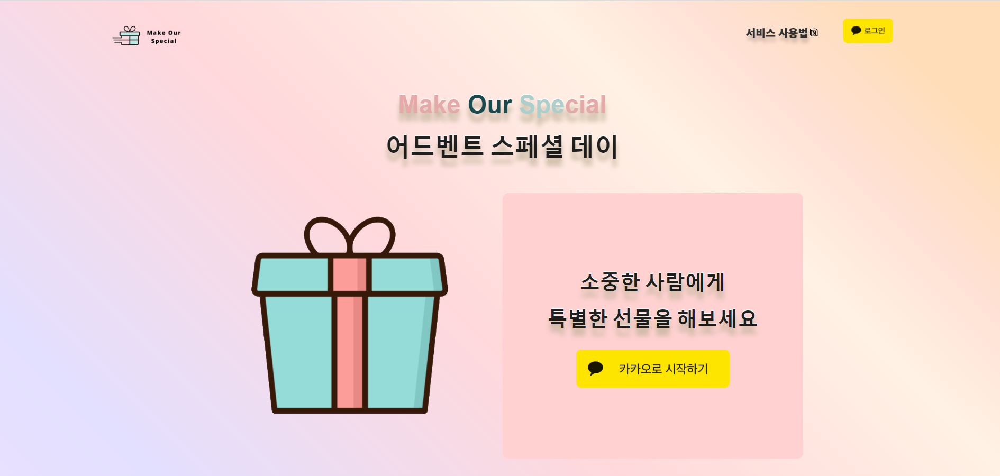

- ##### Make Our Special 어드벤트 스페셜 데이를 작성하기 위해서는 로그인을 해야 됩니다.

- ##### 참고로 보낸 선물은 비회원도 볼 수 있습니다.

  

#### 로그인

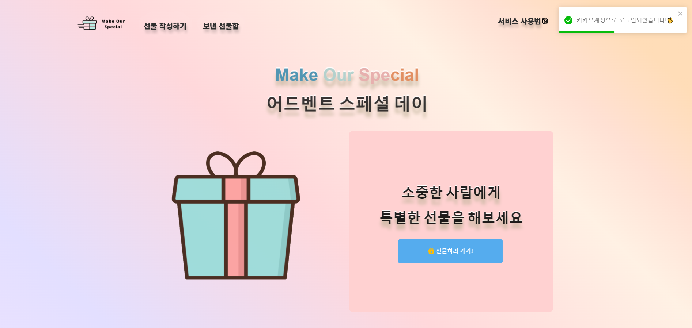

- ##### 카카오톡 로그인을 하면 작성 페이지로 이동합니다.

  

#### 메인페이지 하단

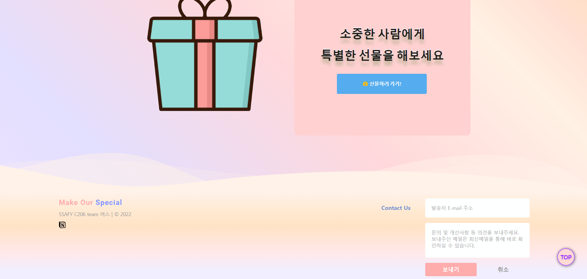

- ##### 페이지 좌측 하단 노션 버튼을 클릭하면 개발자 노트를 보실 수 있습니다.

- ##### 페이지 우측 Contact Us를 누르면 개발자에게 이메일을 보낼 수 있습니다.

- ##### 첫번째 칸에는 자신의 이메일을 작성해주시고, 두번째 칸에는 내용을 작성해주시면 됩니다.

  

#### 기간 선택

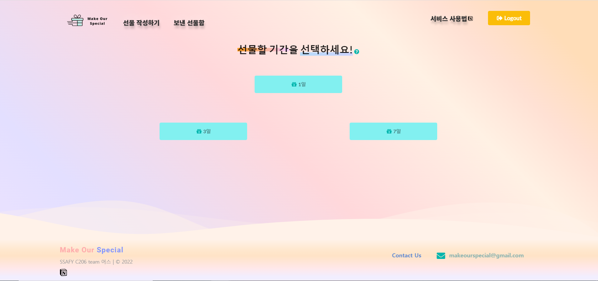

- ##### 어드벤트 캘린더는 1, 3, 7일 총 3종류를 고르실 수 있습니다.

- ##### 1일은 1개, 3일은 3개, 7일은 7개를 작성하실 수 있습니다.

  

#### 어드벤트 생성

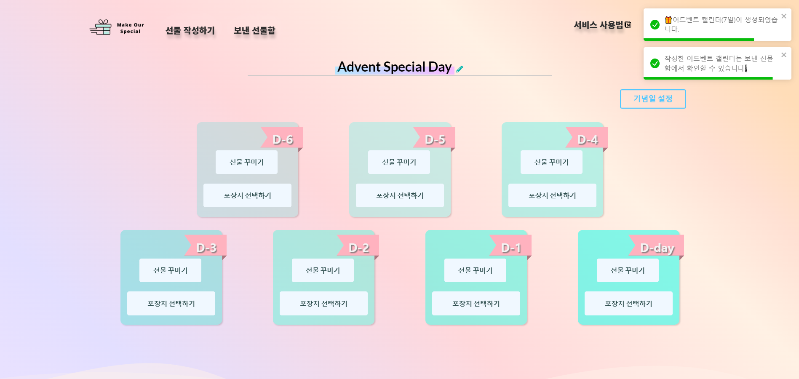

- ##### 예시 사진은 7일 어드벤트 캘린더 입니다.

- ##### 각각의 상자는 내용과 포장지를 선택할 수 있습니다.


#### 배경 선택

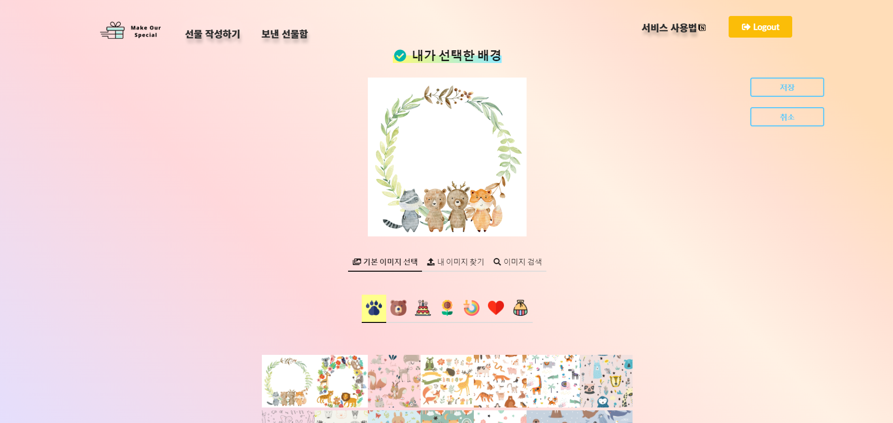

- ##### 6종류 카테고리, 총 160개 기본 이미지 제공

- ##### 기존 이미지 선택을 누르면 Make Our Special에서 제공하는 이미지를 선택하실 수 있습니다.

  

#### 배경 이미지 업로드

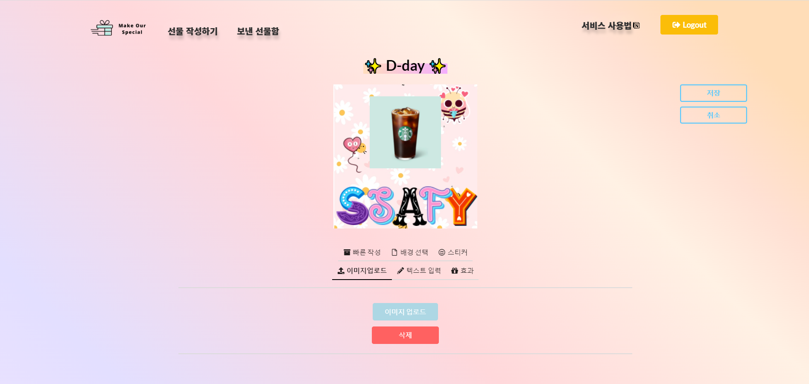

- ##### 이미지 업로드를 통해 선물의 의미를 더해주는 기프티콘 이미지부터  직접 찍은 사진 등을 넣을 수 있습니다.


#### 텍스트 입력

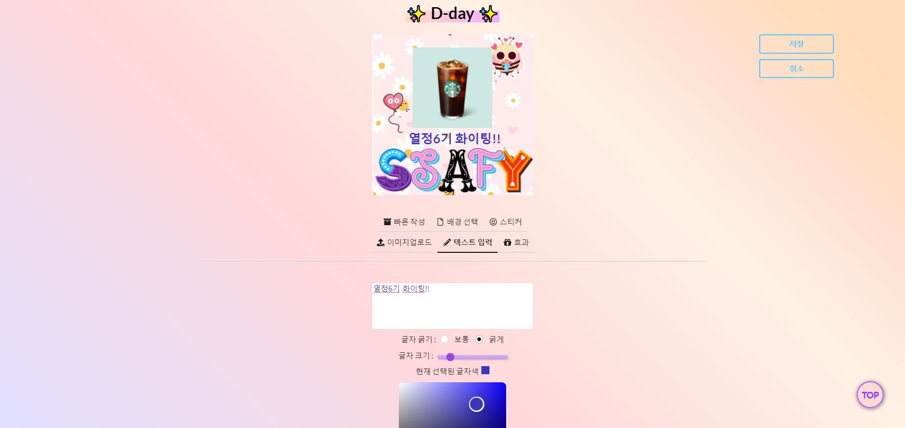

- ##### 원하는 텍스트를 글자 크기와 굵기, 생상을 선택해서 작성할 수 있습니다.

- ##### 처음 클릭하면 이동하고 두번째 클릭 시 고정됩니다.

- ##### 텍스트는 계속 이동할 수 있습니다.

  

#### 색상 선택

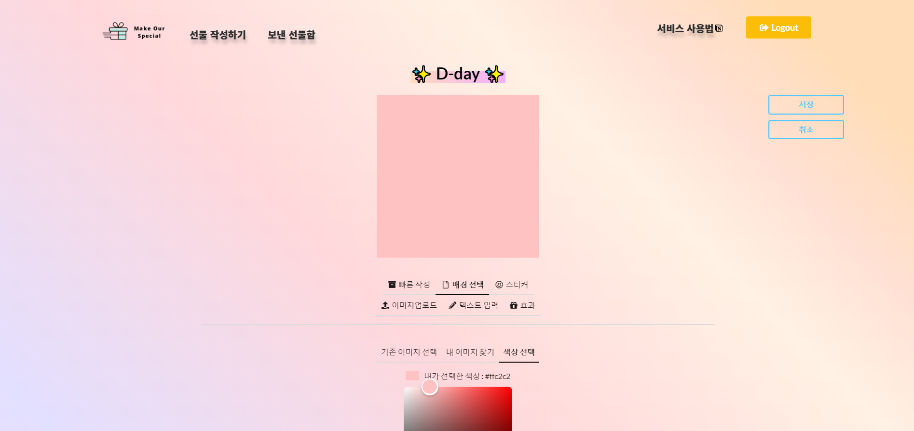

- ##### 심플한 배경을 원하신다면 색상선택을 통해 원하는 색상을 찾아보세요!

  

#### 작성 템플릿

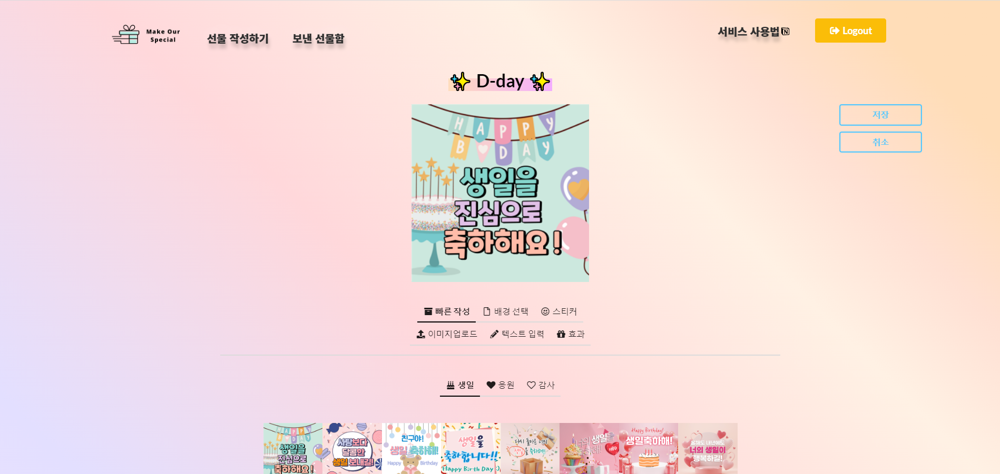

- ##### 빠르게 작성하고 싶은 분들을 위해 고정 템플릿을 제공하고 있습니다.

  

#### 스티커 생성 및 이동

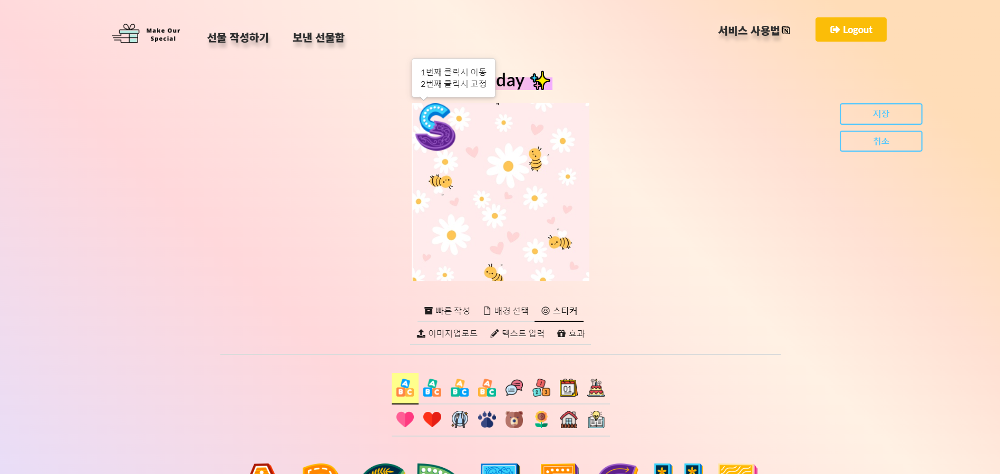

- ##### 아래에서 원하는 스티커를 선택하면 상단에 스티커가 생성됩니다.

- ##### 스티커를 누르면 이동하며 원하는 위치에서 한번 더 누르면 고정됩니다.

- ##### 최대 10개의 중복되지 않은 스티커를 사용할 수 있습니다.

  

#### 스티커 삭제

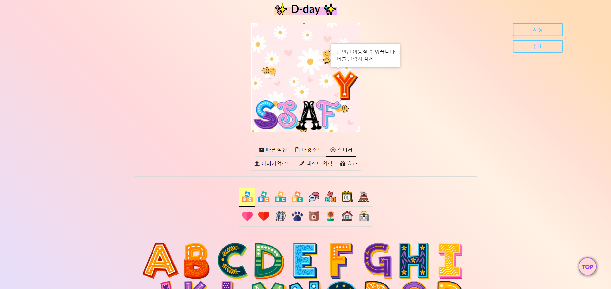

- ##### 스티커는 한번만 이동할 수 있습니다.

- ##### 스티커를 잘못 선택하시거나 마음에 들지 않으신다면 더블클릭을 통해 스티커를 삭제하실 수 있습니다.

  

#### 애니메이션 효과 생성

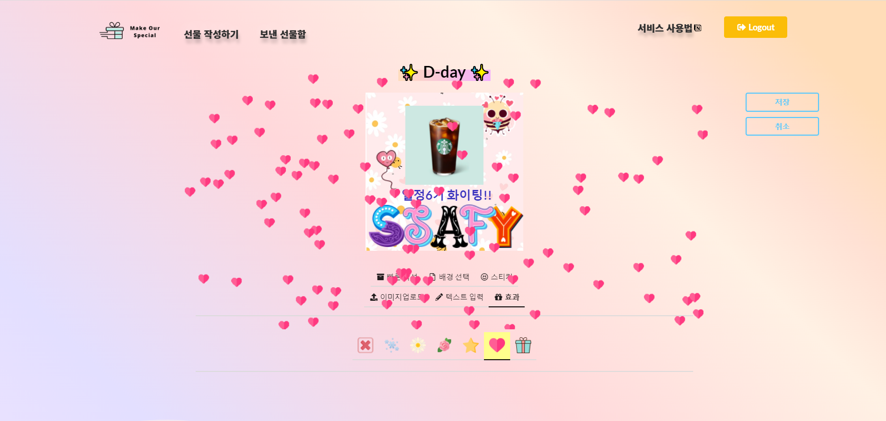

- ##### 6 종류의 효과를 제공하고 있습니다.

- ##### 효과를 사용해 특별함을 추가해보세요!

  

#### 포장지 선택

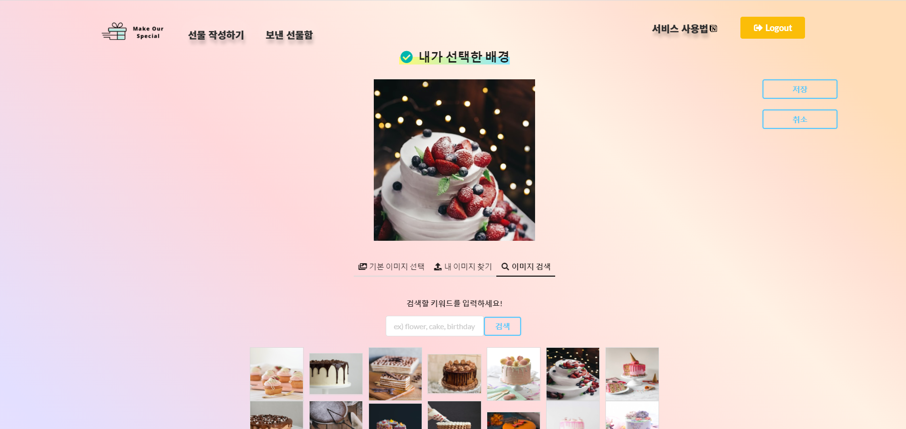

- ##### 7종류 카테고리, 총 196개 기본 이미지 제공

- ##### 기본 이미지는 Make Our Special에서 제공하는 이미지입니다.

- ##### 이미지 검색은 영어 키워드 입력를 통해 검색할 수 있습니다.

- ##### 이미지를 누르면 이미지가 삭제됩니다.

  

#### 포장지 적용 확인

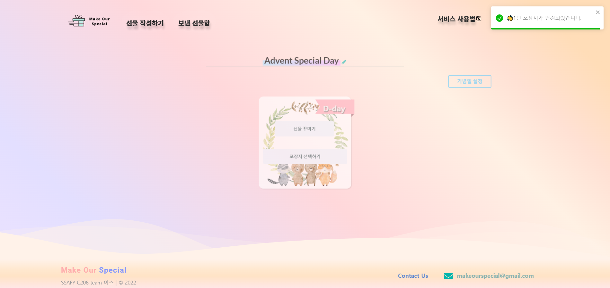

- ##### 포장지를 선택하지면 어드벤트 캘린더 홈화면에서 확인하실 수 있습니다.

  

#### 기념일 및 비밀번호 설정

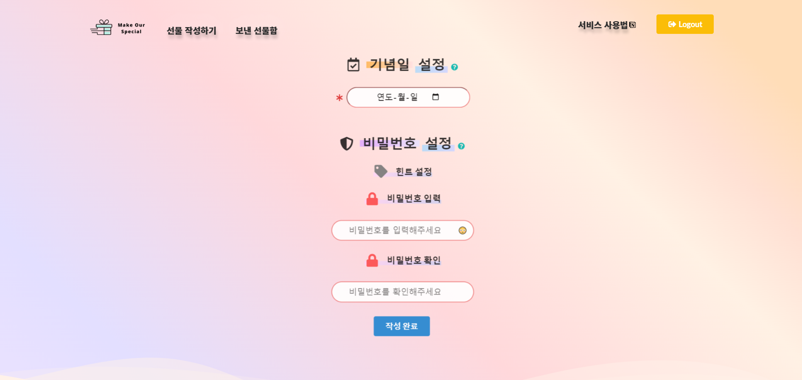

- ##### 기념일 페이지에서는 마지막 선물이 열리는 날짜(D-Day)를 선택하실 수 있습니다.

- ##### 연도, 월, 일을 누르면 각각 수정하실 수 있습니다.

  

#### 보낸 보관함

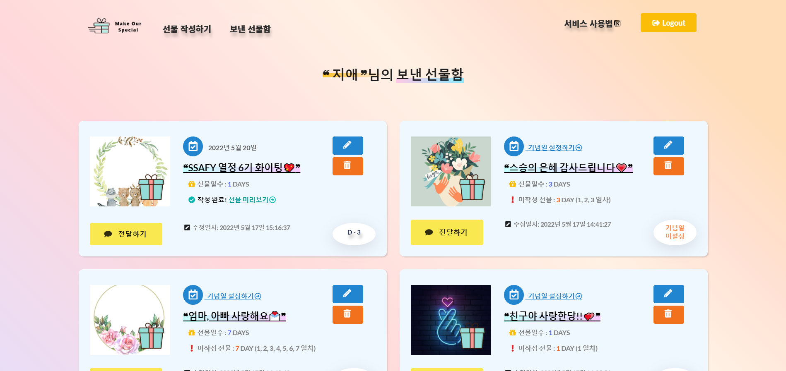

- ##### 자신이 작성한 어드벤트 캘린더를 확인, 수정, 삭제하실 수 있습니다.

- ##### 미 완성된 캘린더를 이어서 작성할 수 있으며, 완성된 캘린더는 전달할 수 있습니다.

- ##### 최근에 수정된 캘린더 순으로 보여줍니다.


#### 미작성 선물

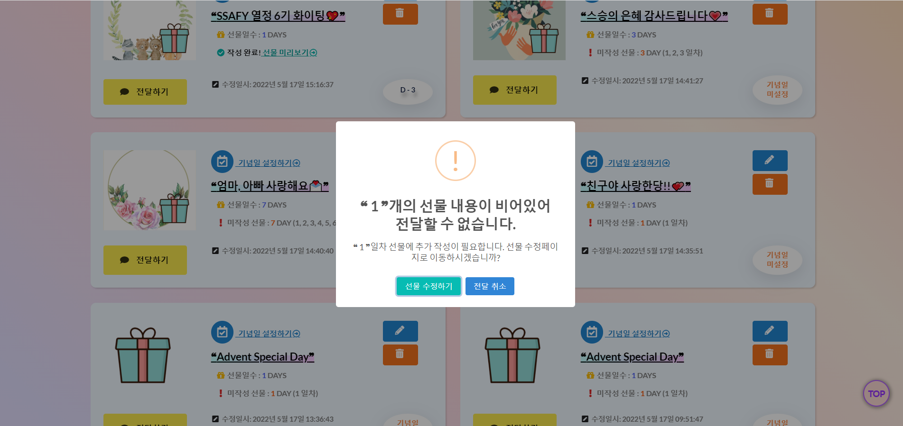

- ##### 캘린더를 완전히 작성하지 않으면 전달할 수 없습니다.

- ##### 모든 내용을 채워주세요!

- ##### 포장지는 선택입니다.


#### 선물 전달

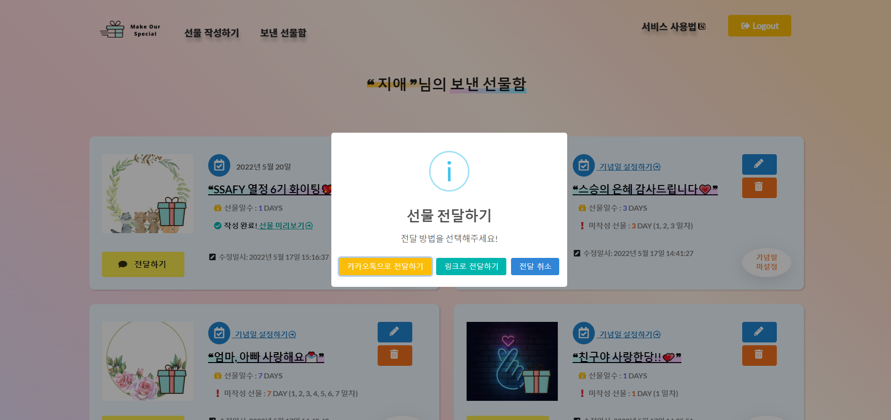

- ##### 카카오톡으로 자신의 친구에게 직접 전달할 수 있습니다.

- ##### 또는 링크를 통해 전달할 수 있습니다.

- ##### 아직 보내고 싶지 않으시다면 전달 취소 버튼을 눌러주세요


#### 선물 카카오톡 공유

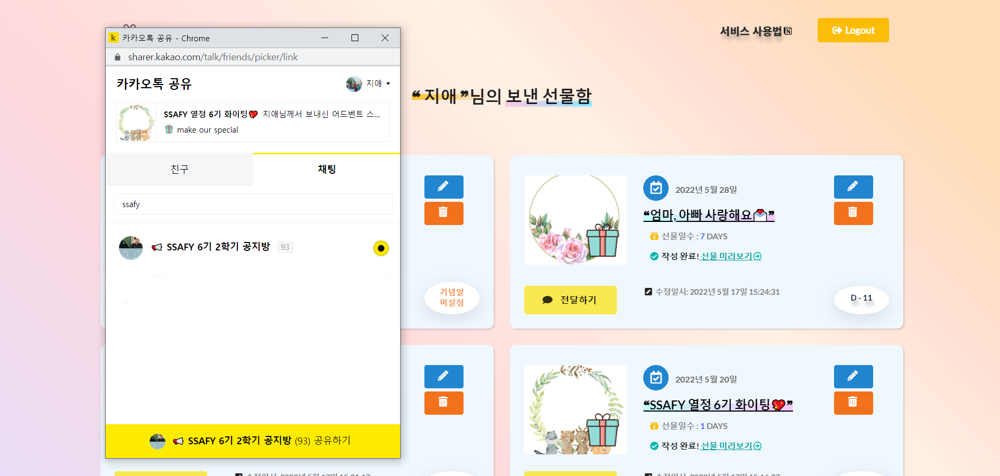

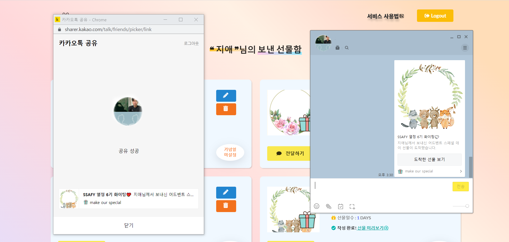

- ##### 카카오톡으로 자신의 친구에게 직접 전달할 수 있습니다.

- ##### 또는 링크를 통해 전달할 수 있습니다.

- ##### 아직 보내고 싶지 않으시다면 전달 취소 버튼을 눌러주세요


#### 선물 링크 복사

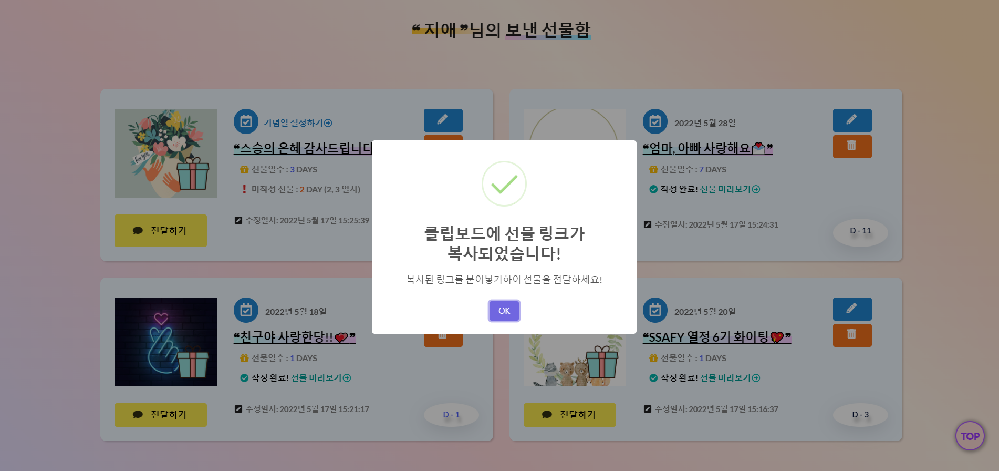

- ##### 링크로 전달하는 화면입니다.

  

#### 선물 비밀번호 입력

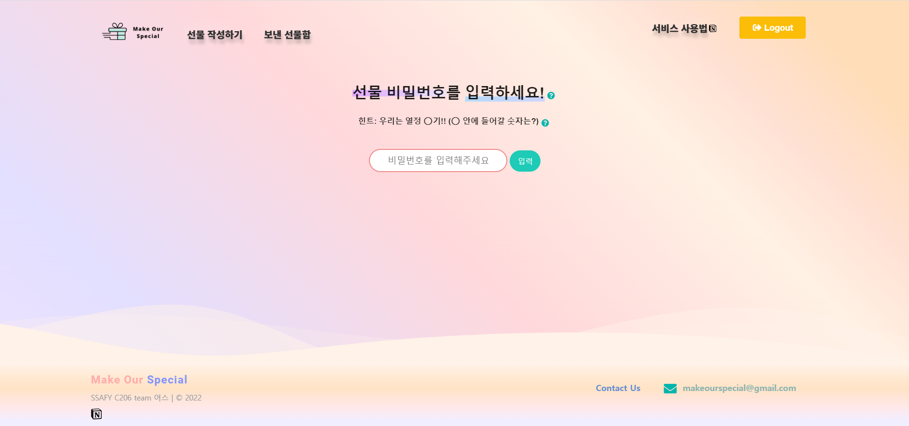

- ##### 비밀번호가 설정되어 있을 때 보여지는 화면입니다.

- ##### 정확한 비밀번호를 입력해야만 내용을 확인할 수 있습니다.

  

#### 받은 선물 확인

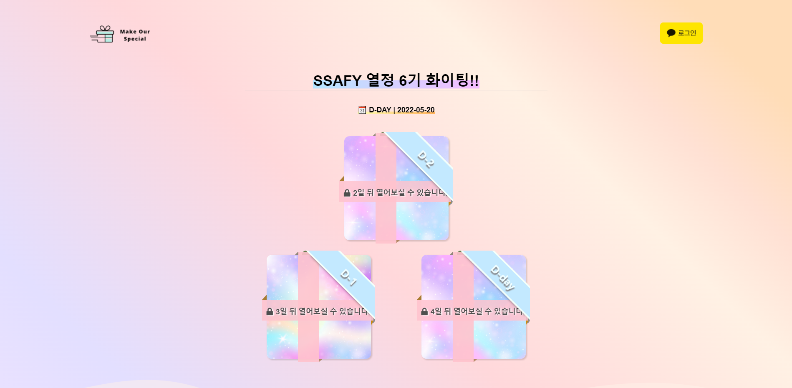

- ##### 받는 사람은 해당 날짜가 된 상자만 열어볼 수 있습니다.

- ##### 해당 날짜에 상자를 보시면 특별한 애니메이션 효과를 보실 수 있습니다.

  

#### Frontend

```
패키지 설치
$ npm install
```
```
프로젝트 실행
$ npm run dev
```


#### Backend <br/>

##### Spring <br />

```
$ java jar jar파일명